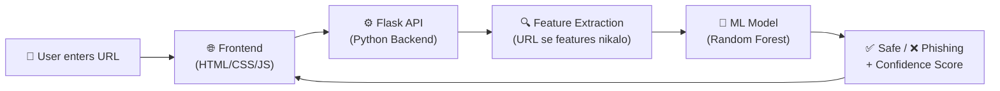

# 🛡️ Phishing URL Detection System — Implementation Plan

## Kya Banana Hai?

Ek **web application** jo user se URL input le aur bata de ki wo URL **Safe** hai ya **Phishing (Fake/Dangerous)** hai. Saath mein ye bhi batayega ki **kyun** phishing hai (reasons).

---

## System Architecture (System Kaise Kaam Karega)



---

## Tech Stack (Kya Kya Use Hoga)

| Component | Technology | Kyun? |
|:--|:--|:--|
| **Frontend (UI)** | HTML5, CSS3, JavaScript | User ko URL daalne ka sundar interface |
| **Backend (Server)** | Python + Flask | URL process karne ke liye server |
| **ML Model** | Scikit-learn (Random Forest) | URL ko phishing ya safe classify karne ke liye |
| **Data** | CSV Dataset (Kaggle se) | Model train karne ke liye data |

---

## Step-by-Step Kya Karenge

### 📁 Project Structure (Files Kaise Hogi)

```
Phishing URL Detection System/
├── app.py                  ← Flask server (main backend)
├── model/
│   ├── train_model.py      ← Model train karne ka script
│   ├── phishing_model.pkl  ← Trained model (saved)
│   └── dataset.csv         ← Training data
├── feature_extractor.py    ← URL se features nikalne ka code
├── templates/
│   └── index.html          ← Frontend HTML page
├── static/
│   ├── css/
│   │   └── style.css       ← Styling
│   └── js/
│       └── script.js       ← Frontend JavaScript
└── requirements.txt        ← Python dependencies
```

---

### Step 1: 📦 Setup & Dependencies

**Kya karenge:** Python environment setup karenge aur required libraries install karenge.

**File: `requirements.txt`**
```
flask
scikit-learn
pandas
numpy
joblib
tldextract
requests
```

**Command:**
```bash
pip install -r requirements.txt
```

---

### Step 2: 🔍 Feature Extractor (URL se Features Nikalo)

**Kya karenge:** URL se 15+ features nikalenge jo batayengi ki URL suspicious hai ya nahi.

**File: `feature_extractor.py`**

Ye features nikalenge:

| # | Feature | Kya Check Karta Hai | Example |
|:--|:--|:--|:--|
| 1 | `url_length` | URL kitni lambi hai | `https://abc.com` = 16 (short = safe) |
| 2 | `has_ip` | Domain mein IP address hai? | `http://192.168.1.1/login` = ❌ Suspicious |
| 3 | `num_dots` | Kitne dots hain | `a.b.c.d.com` = bohot dots = ❌ |
| 4 | `has_at_symbol` | `@` symbol hai? | `http://google.com@evil.com` = ❌ |
| 5 | `has_double_slash` | `//` redirect hai? | Path mein `//` = ❌ |
| 6 | `has_dash` | Domain mein dash hai? | `google-login-secure.com` = ❌ |
| 7 | `num_subdomains` | Kitne subdomains hain | `a.b.c.google.com` = too many = ❌ |
| 8 | `is_https` | HTTPS use ho raha hai? | `http://` = ❌ |
| 9 | `url_depth` | URL mein kitne `/` hain | Deep paths = ❌ |
| 10 | `has_shortening` | URL shortener used? | `bit.ly/xyz` = ❌ |
| 11 | `num_special_chars` | Special characters count | `%20`, `=`, `&` etc. |
| 12 | `domain_length` | Domain name ki length | Bohot lamba domain = ❌ |
| 13 | `num_digits_in_domain` | Domain mein numbers | `g00gle.com` = ❌ |
| 14 | `has_suspicious_words` | Suspicious words check | "login", "secure", "bank", "verify" |
| 15 | `is_encoded` | URL encoded hai? | `%20`, `%3D` etc. = ❌ |

---

### Step 3: 🤖 ML Model Training

**Kya karenge:** Dataset se model train karenge jo URL features dekh ke predict kare — Safe ya Phishing.

**File: `model/train_model.py`**

Steps:
1. CSV dataset load karo (legitimate + phishing URLs)
2. Har URL se features nikalo (Step 2 ka function use karke)
3. Random Forest Classifier train karo
4. Model ko `.pkl` file mein save karo (taaki baar baar train na karna pade)

> [!NOTE]
> **Dataset:** Hum ek ready-made phishing URL dataset use karenge. Agar Kaggle se download nahi ho paaye, toh main code mein hi ek small sample dataset bana dunga jisse model train ho sake.

---

### Step 4: ⚙️ Flask Backend (API)

**Kya karenge:** Flask server banayenge jo:
1. Homepage serve kare (HTML page)
2. `/predict` API endpoint pe URL le aur result de

**File: `app.py`**

```python
# Pseudocode:
@app.route('/predict', methods=['POST'])
def predict():
    url = request.json['url']
    features = extract_features(url)   # Step 2
    prediction = model.predict(features)  # Step 3
    return {
        "result": "Phishing" or "Safe",
        "confidence": 95.5,
        "reasons": ["URL too long", "Has IP address", ...]
    }
```

---

### Step 5: 🎨 Frontend UI (Beautiful Interface)

**Kya karenge:** Ek stunning dark-theme UI banayenge with:

- 🔍 URL input field with glow effect
- 🛡️ Shield animation for scanning
- ✅ Green result for Safe URLs
- ❌ Red result for Phishing URLs
- 📊 Confidence score bar
- 📋 Detailed reasons list
- ✨ Smooth animations & micro-interactions

**Design Features:**
- Dark glassmorphism theme (modern look)
- Gradient accent colors (cyan → purple)
- Animated scanning effect jab URL check ho raha ho
- Result cards with slide-in animation
- Responsive design (mobile pe bhi achha dikhe)

---

## Open Questions

> [!IMPORTANT]
> ### Tumse kuch sawaal hain:
>
> 1. **Python installed hai?** — Kya tumhare system pe Python (3.8+) already installed hai? (`python --version` se check karo)
>
> 2. **pip install** — Kya main `pip install` commands run kar sakta hoon?
>
> 3. **Dataset** — Kya tum Kaggle se dataset download kar sakte ho, ya main code mein hi sample data bana doon?
>
> 4. **Sirf Frontend chahiye?** — Agar Python/ML nahi chahiye, toh main sirf ek **JavaScript-based rule engine** bana sakta hoon (ML ke bina) jo basic URL features check karega. Ye simpler hoga lekin kam accurate hoga.

---

## Two Options Available

### Option A: Full ML System (Python + Flask + ML Model) ⭐ Recommended
- ✅ Accurate results (90%+ accuracy)
- ✅ Real ML model use hoga
- ✅ Production-ready
- ❌ Python + pip install zaroori hai
- ❌ Thoda complex

### Option B: Pure Frontend (HTML + CSS + JS Only)
- ✅ No Python needed
- ✅ Simple to understand
- ✅ Instant setup — sirf browser mein kholo
- ❌ Rule-based detection (ML nahi)
- ❌ Kam accurate (but still useful for learning)

---

## Verification Plan

### Automated Tests
- Model accuracy check karenge (target: 85%+ accuracy)
- Test URLs se predict karke dekhenge:
  - `https://www.google.com` → ✅ Safe
  - `http://192.168.1.1/login/secure/bank` → ❌ Phishing
  - `https://g00gle-secure-login.tk/verify` → ❌ Phishing

### Manual Verification
- Browser mein UI open karenge
- Real URLs daal ke test karenge
- Mobile responsive check karenge

---

> [!TIP]
> **Meri Recommendation:** Agar Python hai toh **Option A** lo (full ML system). Agar sirf HTML/CSS/JS mein chahiye toh **Option B** bhi bahut achha project banega portfolio ke liye!
